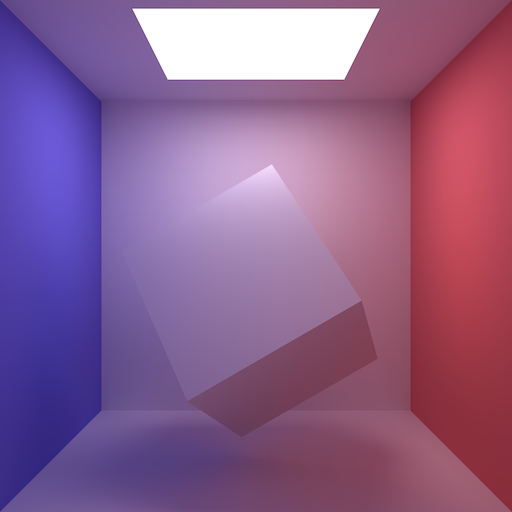

# Radiosity



The aim of this project is to construct a radiosity-based
diffuse-diffuse interaction renderer based on half-remembered
fifteen-plus-year-old knowledge and working it out again from first
principles.

It's more-or-less worked.

## Reconstructing the theory

We'll start with that fact that a matt wall, lit evenly, looks a
single colour. It doesn't get brighter or darker depending on the
angle we view it at, or the distance we view it from. Put another way,
the amount of light our eye receives just depends on how much light
the wall emits per area, and the angle it subtends in our vision.

What does this mean physically?

 * In terms of scale independence, the light will fall off with the
   square of the distance, but so will the area subtended at the eye
   by a given surface, so the light per area remains constant.

 * If light-received-per-area-seen-by-viewer remains constant, the
   amount of light emitted given off must drop off with angle, as the
   amount of surface-per-area-facing-the-viewer increases. This factor
   is cosine of the angle between the viewer and the normal.

We can thus write the amount of light received at a point as

`L = B * A * cos(theta)`

Where `L` is the amount of light, `B` is the brightness of the
emitting surface, `A` is its area, and `theta` is the angle between
the normal of the emitting surface and the ray to the receiver.

How do we find the amount of light received by an area?

Assuming the light comes from a reasonably-point-like light source,
the amount of light received will be proportional to the area, as
measured perpendicular to the ray from the emitter. Putting it all
together, the equation is:

`L_er = B_e * A_e * cos(theta_e) * A_r * cos(theta_r)`

where `e` is the value for the emitter, `r` is the value for the
receiver, and the parameters are otherwise the same as previously.

Rather neatly, the equation is symmetric, demonstrating the nice
symmetry between forwards and backwards ray-tracing, and how the
radiosity solution represents an equilibrium where the net light flow
between pairs of surfaces is zero.

## How much light does a point emit?

If a point has a certain amount of brightness, how much light should
it be giving off in each direction? How can work this out by
integrating the equation above over all directions, to get the total
it emits, and come up with a normalising factor.

To specify directions over the hemisphere we're integrating over,
we'll say that `phi` is the angle from the normal (0 to pi/2), and
`theta` is the angle around the normal (0 to 2 * pi). We want to
calculate the integral of `L(phi) sin(phi) d phi d theta` - the "`sin
phi`" term is because there's a lot more surface around the edge of
the hemisphere than at the top. `L` is symmetric around the normal, so
doesn't depend on `theta`. We have:

```
L(phi) sin(phi) d phi d theta
 = 2 * pi * L(phi) sin(phi) d phi
 = 2 * pi * cos(phi) * cos(rho(phi)) * r(phi)^-2 * A(phi) * sin(phi) d phi
```

where `rho` is the angle on the receiving surface, `r` is the distance
from source to destination for the given angle, and `A` is the rate at
which area is swept out for small changes of `phi` and `theta`.

The `cos(rho(phi)) * r(phi)^-2 * A(phi)` terms all cancel out - as
radius increases, the area being swept out increases, so that the same
amount of light is received. If the receiving surface is at an angle,
more area is swept out, so the change in `A` term balances the change
from `cos(rho(phi))`. The equation simplifies to integrating over:

```
2 * pi * cos(phi) * sin(phi) d phi
```

from 0 to 2 * pi. The integral is... pi.

When I sum up the amount of light emitted by the light source in the
code, and take out all the scaling factors I've added in, the total
light received from sending out a "unit" light is 3.1449! The error is
around one in a thousand, which seems about right since the
calculations are done using transmission to a few thousand rectangles.

We have empirical evidence that the calculations are about right, and
can look into bouncing the light around...

## And the practice?

Source is in this project. :)
